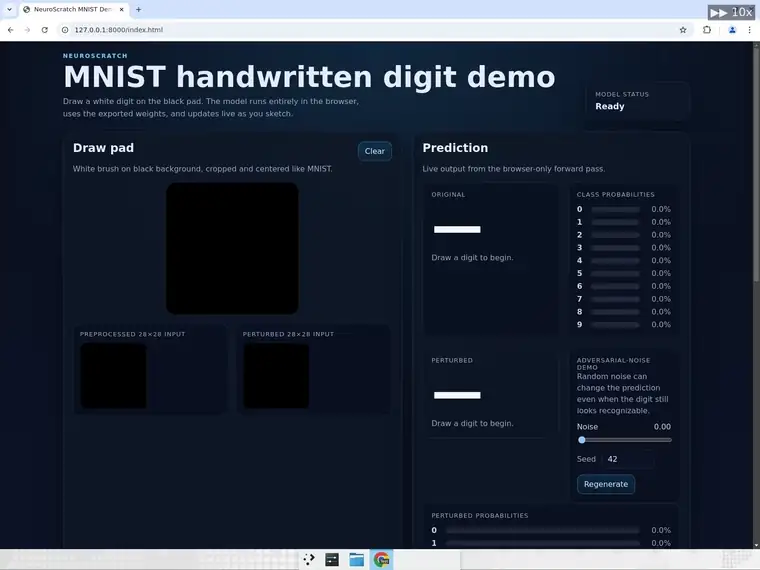
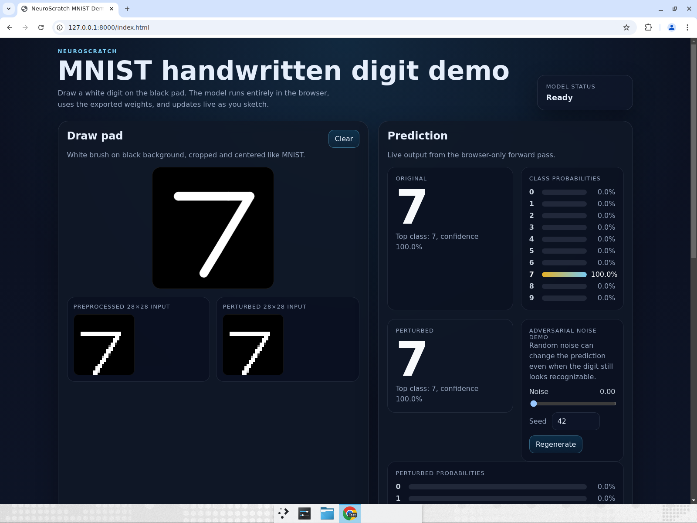
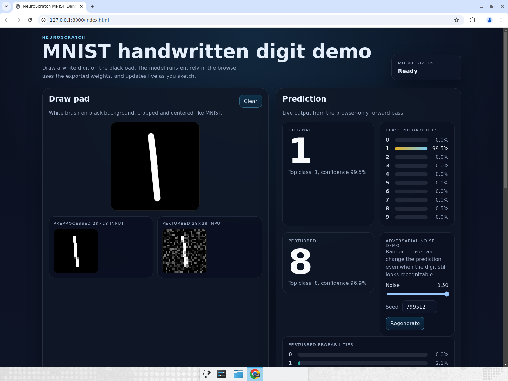
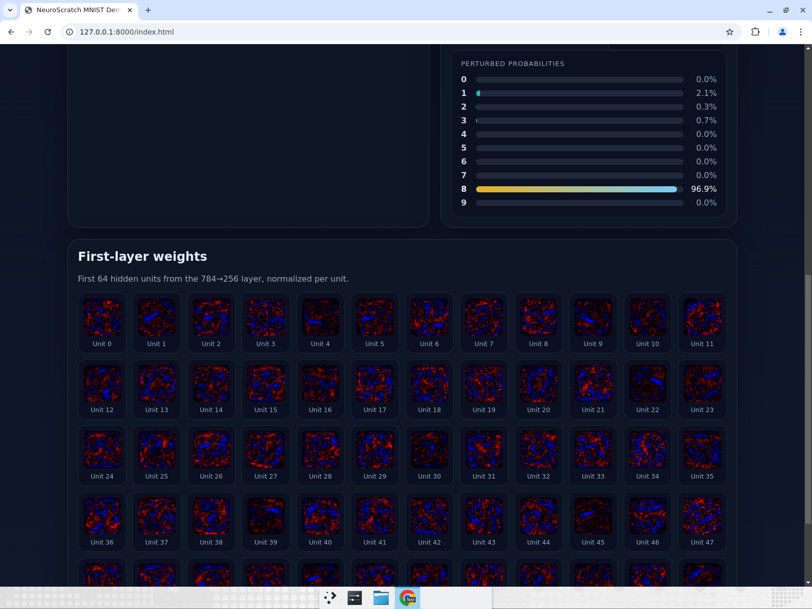

# NeuroScratch

NeuroScratch is a from-scratch NumPy neural network for MNIST. I built it to prove I understand the mechanics behind matrix calculus, backpropagation, and gradient descent instead of leaning on a framework `.fit()` call. The strongest evidence that the math is right is that the from-scratch implementation matches a PyTorch reference closely, and the independent browser inference engine matches Python on fixed test inputs down to floating-point noise.

## Demo

Live demo: https://ypxz.github.io/NeuroScratch/









## Architecture

Repository layout:

- `neuroscratch/model/` — NumPy layers, activations, loss, optimizer, and network container
- `neuroscratch/training/` — MNIST loading, training loop, checkpointing, metrics logging, and gradient checks
- `neuroscratch/reference/` — PyTorch reference used only for cross-validation
- `neuroscratch/export/` — Python-to-JSON weight export for the browser runtime
- `web/` — static frontend, canvas draw pad, JS inference engine, and UI
- `tests/` — gradient checks, cross-validation, and Python/JS parity tests

Canonical network and math:

- Input: 784 floats from a 28x28 grayscale image, flattened row-major and normalized by dividing by 255
- Layer 1: Dense 784 -> 256, then ReLU
- Layer 2: Dense 256 -> 128, then ReLU
- Layer 3: Dense 128 -> 10, then Softmax
- Loss: categorical cross-entropy, averaged over the batch
- Dense forward pass: `z = x @ W + b`
- ReLU: `max(0, z)`
- Softmax: numerically stable, subtract the row max before exponentiation
- Prediction: `argmax(softmax output)`

## Results

| Metric | Result |
| --- | --- |
| From-scratch test accuracy | 98.10% (0.981) |
| Gradient check max relative error | 3.23e-08 vs tolerance 1e-6 |
| PyTorch reference test accuracy | 97.88% (0.9788) |
| From-scratch − PyTorch delta | 0.22 percentage points (0.0022) |
| JS ↔ Python parity | 200/200 fixed test samples matched on argmax; max probability difference 1.67e-15 vs tolerance 1e-5 |
| Final epoch train accuracy | 99.44% |
| Final epoch validation accuracy | 97.58% |

Training artifacts:

- Confusion matrix: `reports/confusion_matrix.png`
- Training curves: `reports/training_curves.png`
- Cross-validation report: `reports/cross_validation.md`

## Reproduce

```bash
python -m venv .venv && source .venv/bin/activate
pip install -e ".[dev]"
# Optional: install the PyTorch reference stack for cross-validation
pip install -e ".[reference]"

# Train the from-scratch model
python -m neuroscratch.training.train

# Export browser weights
python -m neuroscratch.export

# Run verification
pytest
ruff check .
mypy neuroscratch
cd web && node --test parity/parity.test.mjs

# Serve the static demo locally
cd web && python -m http.server 8000
```

## How it works

Backpropagation is implemented by hand in NumPy. Dense layers cache their inputs, ReLU caches its activation mask, and the softmax plus cross-entropy path is written so the gradient can be checked against finite differences. The reported gradient-check maximum relative error is 3.23e-08, which is comfortably below the 1e-6 tolerance.

The PyTorch reference exists as a cross-check, not as the primary implementation. It uses the same canonical architecture, split, seed, initialization, and optimizer settings, so the comparison is meaningful. The small 0.22 percentage-point delta between the from-scratch run and PyTorch reference is what I expected from two independent implementations of the same math.

The browser runtime is independent from the Python training stack. It loads exported JSON weights, runs its own forward pass in plain JavaScript, and uses the same `z = x @ W + b`, ReLU, and numerically stable softmax convention. On 200 fixed test samples, the JS argmax matched Python exactly, and the largest probability difference was 1.67e-15.

## What I'd extend next

- Add convolutional layers and compare them against the current MLP baseline.
- Add learning-rate schedules, weight decay, dropout, and batch normalization.
- Move the browser inference path to WASM for faster on-device evaluation.
- Expand the adversarial demo with FGSM and richer perturbation controls.
- Add more evaluation reporting around per-class errors and calibration.
