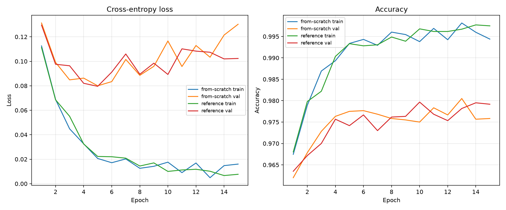
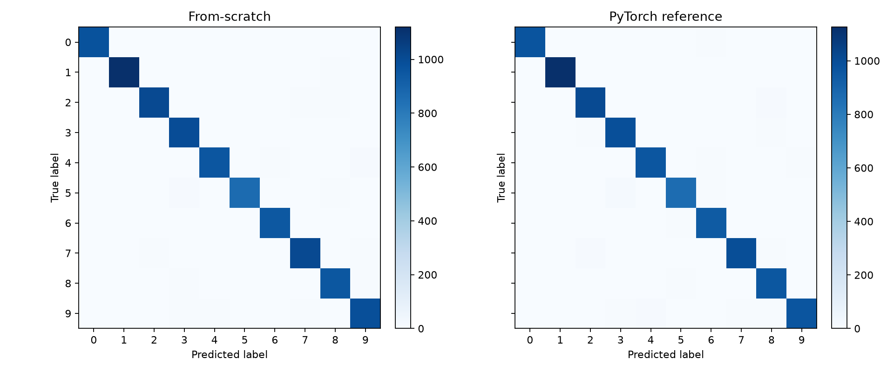

# Cross-validation report

## Final test accuracy

- From-scratch: 0.981000
- PyTorch reference: 0.978800
- Delta (from-scratch - reference): 0.002200

## Training curve comparison

The two runs track closely epoch-by-epoch; the maximum validation-accuracy gap is 0.004667, and both reach their best validation performance late in training.

## Confusion matrices

## Per-class metrics

### From-scratch

**From-scratch per-class metrics**

| Class | Precision | Recall | F1 |
| --- | ---: | ---: | ---: |
| 0 | 0.9909 | 0.9949 | 0.9929 |
| 1 | 0.9956 | 0.9868 | 0.9912 |
| 2 | 0.9758 | 0.9787 | 0.9773 |
| 3 | 0.9688 | 0.9851 | 0.9769 |
| 4 | 0.9896 | 0.9725 | 0.9810 |
| 5 | 0.9863 | 0.9686 | 0.9774 |
| 6 | 0.9854 | 0.9864 | 0.9859 |
| 7 | 0.9768 | 0.9825 | 0.9796 |
| 8 | 0.9704 | 0.9754 | 0.9729 |
| 9 | 0.9705 | 0.9772 | 0.9738 |

### PyTorch reference

**PyTorch reference per-class metrics**

| Class | Precision | Recall | F1 |
| --- | ---: | ---: | ---: |
| 0 | 0.9908 | 0.9878 | 0.9893 |
| 1 | 0.9886 | 0.9921 | 0.9903 |
| 2 | 0.9730 | 0.9787 | 0.9758 |
| 3 | 0.9678 | 0.9822 | 0.9749 |
| 4 | 0.9827 | 0.9807 | 0.9817 |
| 5 | 0.9807 | 0.9709 | 0.9758 |
| 6 | 0.9792 | 0.9812 | 0.9802 |
| 7 | 0.9833 | 0.9708 | 0.9770 |
| 8 | 0.9542 | 0.9836 | 0.9687 |
| 9 | 0.9877 | 0.9584 | 0.9728 |
